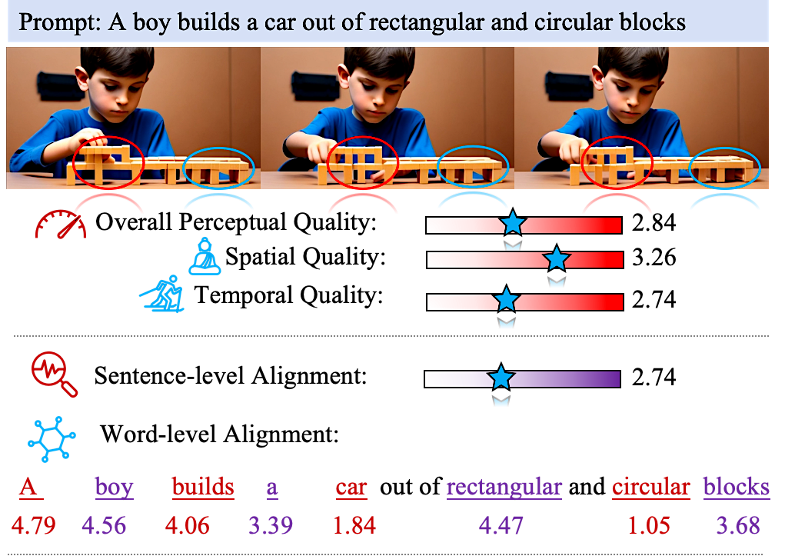
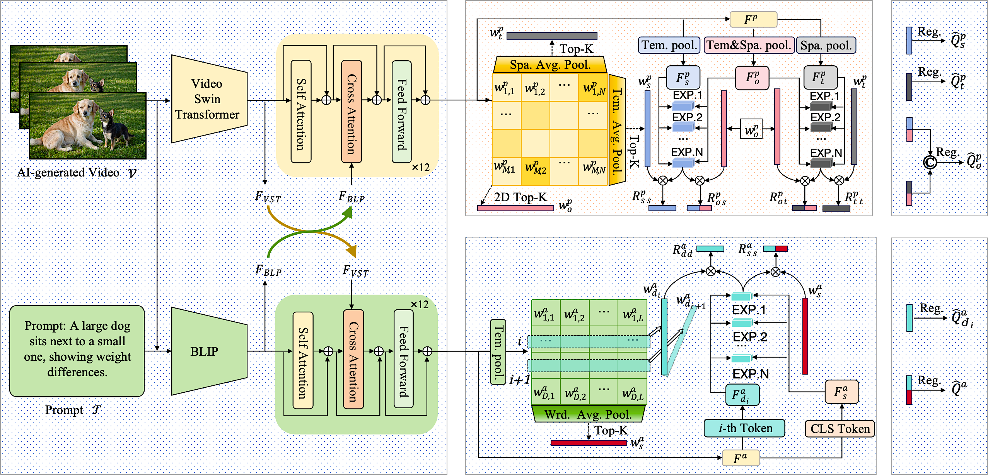
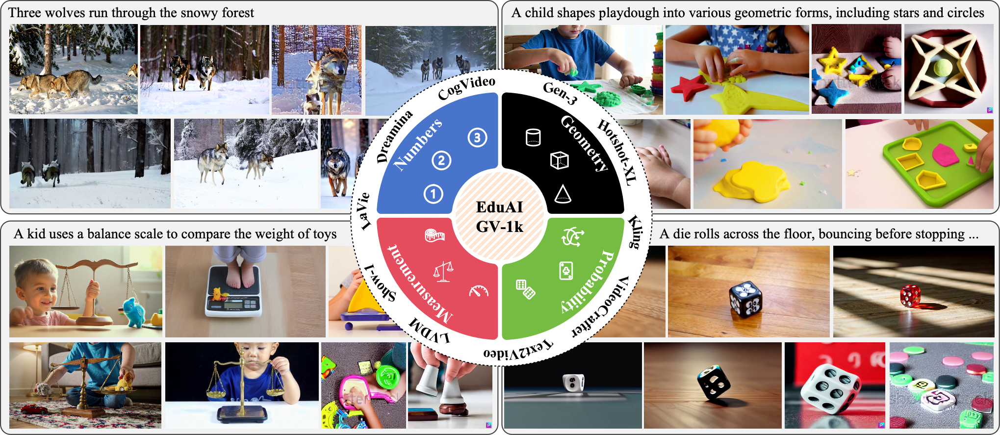
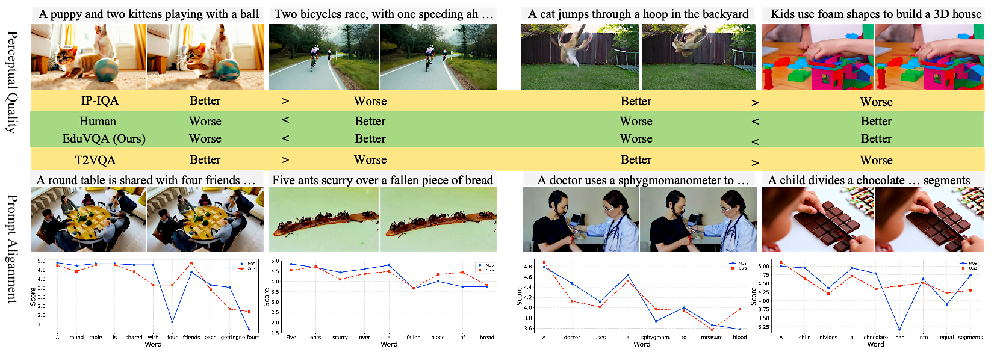
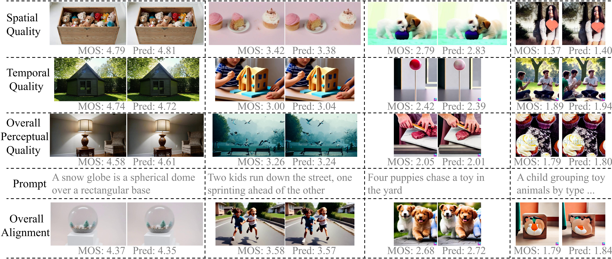
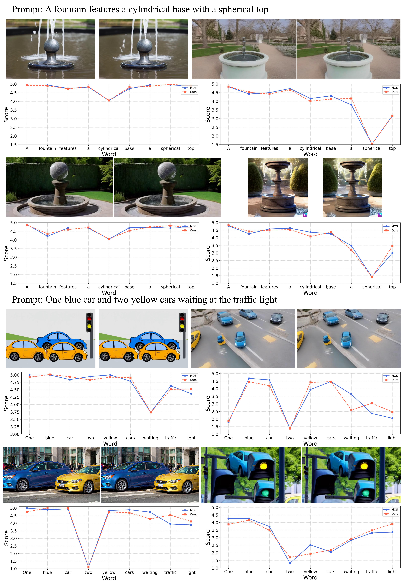

<h2 align="center" style="font-size: 2.5em; font-weight: bold;">
  EduVQA: Towards Concept-Aware Assessment of Educational AI-Generated Videos
</h2>

<p align="center">
  <a href="https://EduVQA.github.io/" style="margin: 0 10px;">🌐 Homepage</a> |
  <a href="https://huggingface.co/datasets/your_dataset" style="margin: 0 10px;">🎞️ Dataset</a> |
  <a href="https://arxiv.org/" style="margin: 0 10px;">📖 Paper</a>
</p>

<p align="center">
  Baoliang Chen*,
  Xinlong Bu*,
  Hanwei Zhu,
  Lingyu Zhu,
  Jieyu Zhan
</p>

---


# 📄 Abstract

<p align="center">
  
</p>

<p align="center">
  <em>
  Annotation structure of our constructed EduAIGV-1k dataset. Each educational video is annotated with spatial and temporal fidelity and word-level semantic consistency, enabling fine-grained assessment of perceptual quality and prompt alignment. The red and blue elliptical regions indicate temporal inconsistencies that negatively impact temporal quality.
  </em>
</p>

Existing AI-generated video quality assessment (AIGVQA) methods mainly focus on global perceptual realism and coarse text-video alignment, while overlooking a critical requirement in educational scenarios: \emph{concept correctness}. In early mathematics education, subtle errors in numerical quantities, geometric relations, or spatial configurations may fundamentally alter the conveyed knowledge despite visually plausible generation.

To address this problem, we introduce **EduAIGVBench**, the first benchmark for concept-aware educational AIGV assessment, containing 1,130 videos generated by ten state-of-the-art T2V models together with over 310,650 fine-grained human annotations spanning perceptual quality and semantic alignment.

Built upon this benchmark, we further propose **EduVQA**, a concept-aware AIGVQA framework equipped with a Structured 2D Mixture-of-Experts (S2D-MoE) architecture. By jointly modeling fine-grained concept assessment and overall quality prediction through shared experts and adaptive two-dimensional routing, EduVQA effectively captures subtle concept-level inconsistencies overlooked by conventional global scoring methods.

Extensive experiments demonstrate that EduVQA consistently outperforms existing AIGVQA approaches across both perceptual and semantic evaluation tasks while exhibiting strong generalization capability on unseen benchmarks. 

---

# 🧠 EduVQA Framework

Our proposed framework introduces a **Structured 2D Mixture-of-Experts (S2D-MoE)** architecture for concept-aware educational video quality assessment.

## 🔹 Framework Overview

<p align="center">
  
</p>

<p align="center">
  <em>Placeholder for the overall EduVQA framework architecture.</em>
</p>

### Key Features

- Concept-aware quality modeling
- Shared expert representation learning
- Adaptive two-dimensional expert routing
- Joint perceptual and semantic assessment
- Strong cross-benchmark generalization

---

# 📚 EduAIGVBench

We introduce **EduAIGVBench**, the first benchmark specifically designed for concept-aware educational AI-generated video assessment.

## 🔹 Benchmark Statistics

- **1,130 AI-generated videos**
- **10 state-of-the-art T2V models**
- **310,650 human annotations**
- Fine-grained perceptual and semantic labels
- Early mathematics education scenarios

---

## 🔹 Dataset Overview

<p align="center">
  
</p>

<p align="center">
  <em>
  An overview of EduAIGVBench, divided into four educational categories: Numbers, Geometry, Measurement, and Probability.
  </em>
</p>

---

## 🔹 Representative Dataset Samples

<p align="center">
  
</p>

<p align="center">
  <em>
  Representative samples from EduAIGVBench across four educational categories.
  </em>
</p>

---

## 🔹 Human Annotation and Quality Levels

<p align="center">
  
</p>

<p align="center">
  <em>
  Qualitative examples across different perceptual and semantic quality dimensions, including spatial fidelity, temporal fidelity, overall perceptual quality, and prompt alignment.
  </em>
</p>

---

# 🔬 Qualitative Analysis and Model Comparison

## 🔹 Cross-Model Comparison

<p align="center">
  
</p>

<p align="center">
  <em>
  Qualitative comparison between EduVQA and existing AIGVQA methods on perceptual quality and prompt alignment evaluation.
  </em>
</p>

---

## 🔹 MOS Prediction Analysis

<p align="center">
  
</p>

<p align="center">
  <em>
  Comparison between predicted quality scores and MOS annotations across multiple quality dimensions.
  </em>
</p>

---

## 🔹 Word-Level Semantic Alignment

<p align="center">
  
</p>

<p align="center">
  <em>
  Word-level alignment prediction curves compared with human MOS annotations.
  </em>
</p>

---

## 🔹 gMAD Comparison

<p align="center">
  
</p>

<p align="center">
  <em>
  gMAD competition results between T2VQA and EduVQA on perceptual quality and prompt alignment assessment.
  </em>
</p>

---

# 📊 Experimental Results

EduVQA achieves state-of-the-art performance across both perceptual quality assessment and semantic alignment evaluation.

## 🔹 Main Results

<p align="center">
  
</p>

<p align="center">
  <em>Placeholder for quantitative comparison results.</em>
</p>

### Highlights

- Consistently outperforms existing AIGVQA baselines
- Strong concept-level reasoning capability
- Better alignment with human judgments
- Excellent generalization on unseen benchmarks

---

# ⚡️ Quick Start

## 1. Installation

```bash
conda create -n eduvqa python=3.10
conda activate eduvqa

pip install -r requirements.txt
